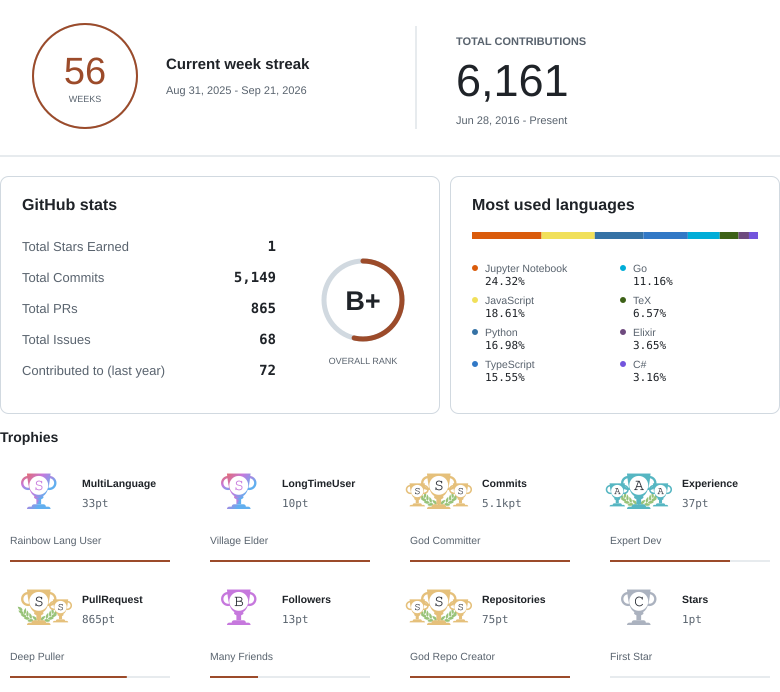

<picture>
  <source media="(max-width: 600px) and (prefers-color-scheme: dark)" srcset="./assets/profile-mobile-dark.svg" />
  <source media="(max-width: 600px)" srcset="./assets/profile-mobile-light.svg" />
  <source media="(prefers-color-scheme: dark)" srcset="./assets/profile-dark.svg" />
  
</picture>

  

